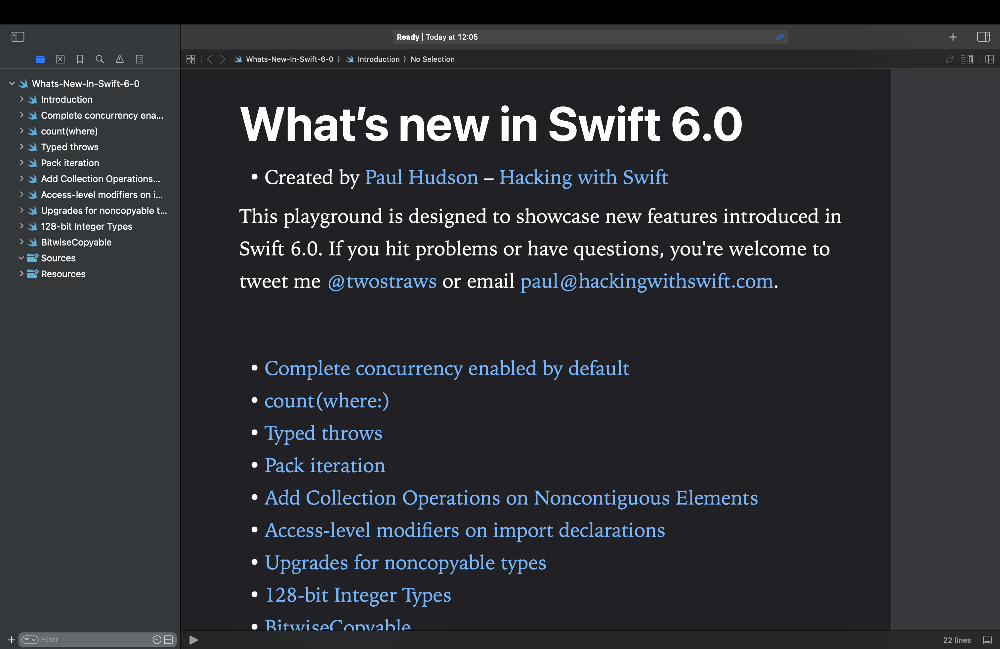

# What’s new in Swift 6.0?

This is an Xcode playground that demonstrates the new features introduced in Swift 6.0: 

* Complete concurrency enabled by default
* count(where:)
* Typed throws
* Pack iteration
* Add Collection Operations on Noncontiguous Elements
* Access-level modifiers on import declarations
* Upgrades for noncopyable types
* 128-bit Integer Types
* BitwiseCopyable

This is designed to complement my existing article [What’s New in Swift 6.0](https://www.hackingwithswift.com/articles/269/whats-new-in-swift-6).

Alternatively, here you can find a complete breakdown of all Swift changes from 1.0 through 6.0, including downloadable playgrounds: [what's new in Swift](https://www.hackingwithswift.com/swift).

If you hit problems or have questions, you're welcome to tweet me [@twostraws](https://twitter.com/twostraws) or email <paul@hackingwithswift.com>.

